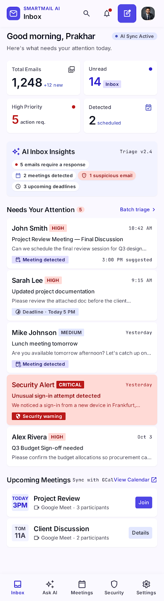

# SmartMail AI

SmartMail AI is a full-stack Gmail workspace for organizing email, understanding conversations, and drafting clearer messages with AI. It combines a React client with a modular Express API, MongoDB, Gmail OAuth, and background workers.

> AI suggestions stay editable. SmartMail never sends a message or creates a calendar event without an explicit user action.



## Features

- Gmail OAuth connection, inbox sync, threaded messages, search, labels, and drafts
- Compose, reply, and save drafts through Gmail
- AI email and thread summaries, reply suggestions, writing, rewriting, and pre-send checks
- Priority, meeting, and suspicious-message detection
- Ask My Inbox with retrieval grounded in the signed-in user's email
- Attachment and inline image previews
- Email verification codes, secure sessions, user settings, and real-time notifications
- Background Gmail sync and AI processing through BullMQ and Redis

AI classification is advisory. Review email content and generated suggestions before acting.

## Architecture

```text
client/  React, Vite, React Router, Redux Toolkit, Axios, Socket.IO client
server/  Express API, Mongoose models, Gmail OAuth/API, AI services, Socket.IO
MongoDB Durable application data and email index
Redis    Rate-limit state, queues, scheduled sync, and worker coordination
Worker   Gmail synchronization, AI analysis, embeddings, and notifications
```

The server is organized into routes, controllers, services, models, middleware, and workers. Protected email and AI operations are scoped to the authenticated user. Gmail access and provider credentials stay on the server.

## Requirements

- Node.js 22.12 or newer
- npm 10.9 or newer
- MongoDB for application data
- Redis for production API rate limits and background jobs
- Google Cloud OAuth web client and the Gmail API for Gmail features
- SMTP credentials for signup verification messages
- An API key for Gemini or OpenAI AI features

## Run locally

### 1. Install dependencies

From the repository root:

```bash
npm ci
```

### 2. Configure the server

Copy `server/.env.example` to `server/.env`, then configure at least:

```dotenv
MONGODB_URI=mongodb://127.0.0.1:27017/smartmail
JWT_SECRET=use-a-random-secret-at-least-32-characters-long
TOKEN_ENCRYPTION_KEY=base64-encoded-32-byte-key
CLIENT_URL=http://localhost:5173
```

Generate secrets with Node.js:

```bash
node -e "console.log(require('node:crypto').randomBytes(48).toString('base64url'))"
node -e "console.log(require('node:crypto').randomBytes(32).toString('base64'))"
```

Use the first value for `JWT_SECRET` and the second for `TOKEN_ENCRYPTION_KEY`. Keep the encryption key backed up and unchanged; Gmail OAuth tokens stored in MongoDB depend on it.

Configure the remaining values in `server/.env` as needed:

- **Signup verification:** `SMTP_HOST`, `SMTP_PORT`, `SMTP_SECURE`, `SMTP_USER`, `SMTP_PASSWORD`, and `SMTP_FROM`.
- **Gmail:** `GOOGLE_CLIENT_ID`, `GOOGLE_CLIENT_SECRET`, and `GOOGLE_REDIRECT_URI=http://localhost:5000/api/gmail/callback`. Enable the Gmail API and register that exact redirect URI on your Google OAuth web client.
- **AI:** set `AI_PROVIDER=gemini` with `GEMINI_API_KEY`, or `AI_PROVIDER=openai` with `OPENAI_API_KEY`. Keep these keys on the server.
- **Background jobs:** set `REDIS_URL` to use Redis-backed queues locally. Without Redis, local development uses the in-process queue where supported.

See [`server/.env.example`](server/.env.example) for all available options. Never commit `.env` files or put server secrets in `VITE_*` variables.

### 3. Start the app

```bash
npm run dev
```

Open [http://localhost:5173](http://localhost:5173). Register, enter the email verification code, connect Gmail, and sync the inbox.

The API health endpoint is [http://localhost:5000/api/health](http://localhost:5000/api/health). The worker can be started separately with:

```bash
npm run worker
```

## Production deployment

The included [`vercel.json`](vercel.json) configures the Vite client build. A production setup can deploy the client to Vercel, the API and background worker as separate Render services, MongoDB on Atlas, and Redis as a managed Key Value service.

1. Configure production secrets and connection strings in the API host's secret store.
2. Run `npm run db:indexes` once against the production database.
3. Create the Atlas Vector Search index from [`server/vector-index.json`](server/vector-index.json). Keep `EMBEDDING_DIMENSIONS` aligned with the index definition (default: `768`).
4. Deploy the API with `npm start` and set its health check to `/api/health`.
5. Deploy the background worker with `npm run worker`; configure it with the same MongoDB, Redis, Gmail, and AI settings it needs to process queued jobs.
6. Build the client with `VITE_API_BASE_URL=https://api.example.com/api` and `VITE_SOCKET_URL=https://api.example.com`.
7. For subdomain deployments, set `CLIENT_URL=https://app.example.com`, `GOOGLE_REDIRECT_URI=https://api.example.com/api/gmail/callback`, `COOKIE_DOMAIN=example.com`, and `TRUST_PROXY=1` on the API.

Serve the client and API from subdomains of the same site, such as `app.example.com` and `api.example.com`, to support secure browser cookies. The production API requires `REDIS_URL` and `TOKEN_ENCRYPTION_KEY`.

Google OAuth testing mode only permits configured test users. Public Gmail access requires Google OAuth app verification for the scopes this app requests; review Google Workspace's current verification requirements before launch.

See the [deployment notes](deployment.md.md) for additional configuration details.

## Project documentation

- [Product requirements](PRD.md)
- [Architecture](Architecture.md.md)
- [API reference](API.md.md)
- [Database design](database.md.md)
- [Feature details](features.md.md)
- [Security notes](Security.md.md)
- [AI instructions](AI_Instructions.md.md)
- [Deployment notes](deployment.md.md)
- [Design files and screens](UI_UX/stitch_smartmail_ai_web_client/)

## Security

- Passwords are hashed; sessions use HTTP-only cookies.
- Signup verification codes are stored as keyed hashes, expire, and have attempt and resend limits.
- Gmail OAuth tokens are encrypted at rest with AES-256-GCM.
- Incoming email HTML is sanitized before display.
- AI uses bounded, user-scoped email context; email content is treated as untrusted input.
- AI results are suggestions and risk signals, not guarantees.

Report security concerns privately to the repository owner rather than posting credentials or personal email content in an issue.

## License

This project is licensed under the [MIT License](LICENSE).
