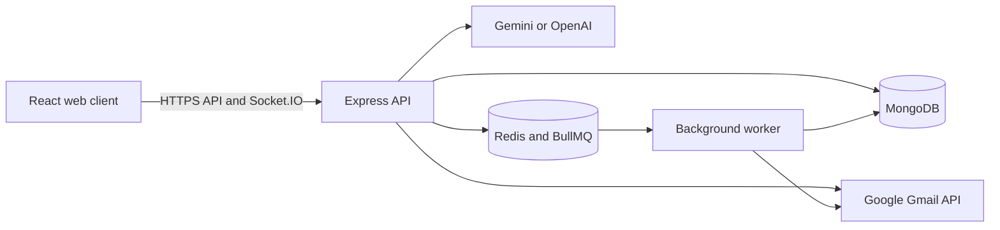

# SmartMail AI

<p align="center">
  <strong>A calmer Gmail workspace with practical AI assistance.</strong><br />
  Organize conversations, find answers across your inbox, and draft messages while keeping every suggestion under your control.
</p>

<p align="center">
  <a href="https://github.com/prakharpatel16/smartmail-ai"></a>
  <a href="LICENSE"></a>
  
  
</p>

> [!IMPORTANT]
> AI output is advisory and editable. SmartMail does not send a message or create a calendar event without an explicit user action.

## Explore

- [What it does](#what-it-does)
- [How it fits together](#how-it-fits-together)
- [Run it locally](#run-it-locally)
- [Configure integrations](#configure-integrations)
- [Deploy](#deploy)
- [Security](#security)
- [License](#license)

## What it does

<details>
<summary><strong>Mailbox and writing</strong></summary>

- Connect a Google account with Gmail OAuth, then sync, search, and organize messages.
- Read conversations, inspect attachments and inline images, and manage starred, sent, draft, and trash views.
- Compose, reply, save drafts, and send messages through Gmail.
- Use AI to summarize conversations, suggest replies, write or rewrite drafts, and check text before sending.

</details>

<details>
<summary><strong>Inbox intelligence</strong></summary>

- Ask questions about the signed-in user's email with user-scoped retrieval.
- Detect message priority, suspicious signals, and meeting details.
- Review AI analysis before acting; detections can be wrong and are not security guarantees.

</details>

<details>
<summary><strong>Account and background work</strong></summary>

- Verify new accounts by email code and protect sessions with HTTP-only cookies.
- Configure user preferences and receive real-time notifications.
- Run Gmail synchronization and AI processing in background workers backed by Redis and BullMQ.

</details>

## How it fits together



The code is split into a Vite client and an Express server. The server separates routes, controllers, services, models, middleware, and workers. MongoDB stores application data; Redis coordinates queues, scheduled synchronization, and production rate-limit state.

| Part | Main technologies | Responsibility |
| --- | --- | --- |
| Client | React, Vite, Redux Toolkit, React Router | Mail workspace and account settings |
| API | Express, Mongoose, Socket.IO | Authenticated APIs, Gmail access, and live updates |
| Worker | BullMQ, Redis | Gmail sync and asynchronous AI analysis |
| Integrations | Gmail API, Gemini or OpenAI, SMTP | Mailbox access, AI assistance, verification email |

## Run it locally

### Prerequisites

- Node.js **22.12+** and npm **10.9+**
- MongoDB
- A Google OAuth web client with the Gmail API enabled
- SMTP credentials for account verification
- A Gemini or OpenAI API key for AI features
- Redis for production-style queues and a separate worker (optional for basic local development)

<details>
<summary><strong>1. Install dependencies</strong></summary>

From the repository root:

```bash
npm ci
```

</details>

<details>
<summary><strong>2. Configure the API</strong></summary>

Copy `server/.env.example` to `server/.env` and fill in the values for the integrations you want to use. At minimum, configure MongoDB, a strong JWT secret, and the token encryption key.

Generate both secrets with Node.js:

```bash
node -e "console.log(require('node:crypto').randomBytes(48).toString('base64url'))"
node -e "console.log(require('node:crypto').randomBytes(32).toString('base64'))"
```

Use the first value as `JWT_SECRET` and the second as `TOKEN_ENCRYPTION_KEY`. Back up the encryption key securely and keep it unchanged: stored Gmail OAuth tokens depend on it.

Common local settings:

```dotenv
CLIENT_URL=http://localhost:5173
MONGODB_URI=mongodb://127.0.0.1:27017/smartmail
GOOGLE_REDIRECT_URI=http://localhost:5000/api/gmail/callback
```

The full variable list and safe defaults are in [`server/.env.example`](server/.env.example). Never commit `.env` files or expose server credentials through `VITE_*` variables.

</details>

<details>
<summary><strong>3. Configure Google, email, and AI</strong></summary>

**Google Gmail OAuth**

1. Create an OAuth **Web application** client in Google Cloud and enable the Gmail API for its project.
2. Add `http://localhost:5000/api/gmail/callback` to the OAuth client's authorized redirect URIs.
3. Set `GOOGLE_CLIENT_ID` and `GOOGLE_CLIENT_SECRET` in `server/.env`.
4. During OAuth testing, add each account under Google Auth Platform's test users. Public access requires Google's verification for the requested scopes.

**Signup verification email**

Set `SMTP_HOST`, `SMTP_PORT`, `SMTP_SECURE`, `SMTP_USER`, `SMTP_PASSWORD`, and `SMTP_FROM` in `server/.env`.

**AI features**

Set `AI_PROVIDER=gemini` and `GEMINI_API_KEY`, or set `AI_PROVIDER=openai` and `OPENAI_API_KEY`. Keep provider keys on the server.

</details>

<details>
<summary><strong>4. Start the app</strong></summary>

Start the client and API together from the repository root:

```bash
npm run dev
```

- Web client: [http://localhost:5173](http://localhost:5173)
- API health: [http://localhost:5000/api/health](http://localhost:5000/api/health)

For Redis-backed background processing, set `REDIS_URL` and run the worker in another terminal:

```bash
npm run worker
```

</details>

## Deploy

The repository includes a `vercel.json` for the Vite client build. A scalable deployment can host the client and API separately, run the worker as its own process, and use managed MongoDB and Redis services.

1. Provision MongoDB, Redis, the API service, the client hosting, and a worker process.
2. Add production secrets to the API and worker secret stores. Do not put server secrets in the client build environment.
3. Set `CLIENT_URL` to the deployed client origin and `GOOGLE_REDIRECT_URI` to `https://<api-host>/api/gmail/callback`; add the exact URI to the Google OAuth client.
4. Build and serve the API with `npm start`; set its health check to `/api/health`.
5. Run background processing with `npm run worker`. Configure it with the MongoDB, Redis, Gmail, and AI settings it needs.
6. Build the client with `VITE_API_BASE_URL=https://<api-host>/api` and `VITE_SOCKET_URL=https://<api-host>`.
7. Set `REDIS_URL`, `TOKEN_ENCRYPTION_KEY`, `TRUST_PROXY=1` (when behind a trusted proxy), and cookie settings for your domain. Prefer client and API subdomains under the same parent domain so secure cookies can be configured appropriately.
8. Run database index setup once: `npm run db:indexes`. Configure the MongoDB Atlas Vector Search index using `server/vector-index.json`; keep its dimensions aligned with `EMBEDDING_DIMENSIONS`.

Production requires HTTPS, managed secrets, `REDIS_URL`, and a persistent `TOKEN_ENCRYPTION_KEY`. Verify OAuth consent-screen requirements and production redirect URLs before allowing external users to connect Gmail.

## Security

- Passwords are hashed, and browser sessions use HTTP-only cookies.
- Verification codes are stored as keyed hashes and expire with attempt and resend limits.
- Gmail OAuth tokens are encrypted at rest with AES-256-GCM.
- Incoming email HTML is sanitized before display; treat email content and attachments as untrusted.
- AI context is bounded and scoped to the signed-in user. Generated text and risk signals require human review.
- Keep `.env` files and credentials out of Git, client bundles, logs, and support screenshots.

For security concerns, contact the repository owner privately; do not post credentials or private email content in a public issue.

## License

SmartMail AI is available under the [MIT License](LICENSE).
